# 🌐 Custom DDNS

> A fast, reliable, and extensible Dynamic DNS service written in Rust


Custom DDNS automatically monitors your IP address and updates DNS records when changes are detected. Built for reliability and performance, it supports multiple IP sources and DNS providers with configurable monitoring intervals.

## ✨ Features

- 🚀 **High Performance**: Async/await architecture with concurrent record processing
- 🔄 **Real-time Monitoring**: Configurable check intervals for each DNS record
- 🌍 **Multi-Provider Support**: Extensible architecture for multiple DNS providers
- 🏠 **Freebox Integration**: Native support for Freebox routers (French ISP)
- ☁️ **Cloudflare Ready**: Built-in Cloudflare DNS provider support
- 🔧 **Flexible Configuration**: YAML-based configuration with validation
- 📊 **Comprehensive Logging**: Structured logging with tracing support
- 🛡️ **Input Validation**: Robust validation for IP addresses and DNS records
- 💾 **Memory Efficient**: Minimal resource usage with smart caching
- 🔄 **Graceful Shutdown**: Proper signal handling for clean termination
- 🏗️ **Multi-Architecture**: Native binaries for Linux and macOS (AMD64 + ARM64)
- 🐳 **Container Ready**: Docker images for both Debian and Alpine with multi-arch support

## 🚀 Quick Start

### Prerequisites

- Access to your DNS provider's API (currently supports Cloudflare)
- Compatible IP source (currently supports Freebox)

**For building from source:**
- Rust 2024 edition or later

### Installation

#### Option 1: Download Pre-built Binaries (Recommended)

Download the latest binary for your platform from the [Releases page](https://github.com/deimosfr/custom-ddns/releases):

- **Linux**: `custom-ddns-linux-amd64` or `custom-ddns-linux-arm64`
- **macOS**: `custom-ddns-macos-amd64` or `custom-ddns-macos-arm64`

```bash
# Make executable (Linux/macOS)
chmod +x custom-ddns-*

# Run with default configuration  
./custom-ddns-linux-amd64
```

#### Option 2: Build from Source

```bash
# Clone the repository
git clone https://github.com/deimosfr/custom-ddns.git
cd custom-ddns

# Build the project
cargo build --release

# Run with default configuration
./target/release/custom-ddns
```

### Docker

#### Pre-built Images (Recommended)

```bash
# From GitHub Container Registry (ghcr.io)
# Debian-based (default, recommended)
docker pull ghcr.io/deimosfr/custom-ddns:latest
docker run -v ./config.yaml:/app/config.yaml ghcr.io/deimosfr/custom-ddns:latest

# Alpine-based (smaller size)
docker pull ghcr.io/deimosfr/custom-ddns:latest-alpine
docker run -v ./config.yaml:/app/config.yaml ghcr.io/deimosfr/custom-ddns:latest-alpine

# From Docker Hub (docker.io)
# Debian-based (default, recommended)
docker pull deimosfr/custom-ddns:latest
docker run -v ./config.yaml:/app/config.yaml deimosfr/custom-ddns:latest

# Alpine-based (smaller size)
docker pull deimosfr/custom-ddns:latest-alpine
docker run -v ./config.yaml:/app/config.yaml deimosfr/custom-ddns:latest-alpine

# Specific version (replace v0.1.0 with desired version)
docker pull ghcr.io/deimosfr/custom-ddns:v0.1.0
docker pull deimosfr/custom-ddns:v0.1.0
```

#### Available Image Tags

**GitHub Container Registry (ghcr.io):**
- `latest` - Latest Debian-based image (multi-arch: amd64, arm64)
- `latest-alpine` - Latest Alpine-based image (multi-arch: amd64, arm64)  
- `v{VERSION}` - Specific version Debian-based (e.g., `v0.1.0`)
- `v{VERSION}-alpine` - Specific version Alpine-based (e.g., `v0.1.0-alpine`)

**Docker Hub (docker.io):**
- `latest` - Latest Debian-based image (multi-arch: amd64, arm64)
- `latest-alpine` - Latest Alpine-based image (multi-arch: amd64, arm64)  
- `v{VERSION}` - Specific version Debian-based (e.g., `v0.1.0`)
- `v{VERSION}-alpine` - Specific version Alpine-based (e.g., `v0.1.0-alpine`)

All images support both AMD64 and ARM64 architectures and are automatically built from the latest releases.

#### Build Locally

```bash
# Build Debian-based image
docker build -t custom-ddns .

# Build Alpine-based image  
docker build -f Dockerfile.alpine -t custom-ddns:alpine .

# Run with mounted configuration
docker run -v /path/to/config.yaml:/app/config.yaml custom-ddns
```

## 📋 Configuration

Create a `config.yaml` file in your project directory:

```yaml
dns_records:
  - name: "home-ipv4"
    source:
      freebox:
        url: "http://mafreebox.freebox.fr"  # Optional, defaults to standard URL
        token: "your_freebox_app_token"
      check_interval_in_seconds: 300  # Check every 5 minutes
    domain:
      provider: "cloudflare"
      domain_name: "example.com"
      record_name: "home"
      record_type: "A"  # or AAAA for IPv6
      record_ttl: 300
      api_key: "your_cloudflare_api_key"

  - name: "home-ipv6"
    source:
      freebox:
        token: "your_freebox_app_token"
      check_interval_in_seconds: 300
    domain:
      provider: "cloudflare"
      domain_name: "example.com"
      record_name: "home"
      record_type: "AAAA"
      record_ttl: 300
      api_key: "your_cloudflare_api_key"
```

### Configuration Options

| Field | Description | Required | Default |
|-------|-------------|----------|---------|
| `name` | Unique identifier for the DNS record | ✅ | - |
| `source.freebox.url` | Freebox API URL | ❌ | `http://mafreebox.freebox.fr` |
| `source.freebox.token` | Freebox application token | ✅ | - |
| `source.check_interval_in_seconds` | Monitoring interval in seconds | ✅ | - |
| `domain.provider` | DNS provider (currently: `cloudflare`) | ✅ | - |
| `domain.domain_name` | Your domain name | ✅ | - |
| `domain.record_name` | DNS record name (subdomain) | ✅ | - |
| `domain.record_type` | Record type: `A`, `AAAA`, `CNAME`, `MX`, `TXT`, `SRV` | ✅ | - |
| `domain.record_ttl` | TTL in seconds (60-86400) | ✅ | - |
| `domain.api_key` | DNS provider API key | ✅ | - |

## 🔧 Supported Providers

### 📡 IP Sources

#### Freebox
Native integration with Freebox routers (Free.fr ISP in France).

**Setup Requirements:**
1. Generate an application token (see [Freebox Documentation](doc/freebox.md))
2. Configure the token in your `config.yaml`

### ☁️ DNS Providers

#### Cloudflare
Full support for Cloudflare DNS management.

**Setup Requirements:**
1. Obtain a Cloudflare API token with Zone:Edit permissions
2. Add the API key to your configuration

## 📖 Usage Examples

### Basic Usage

```bash
# Run with default config file (config.yaml)
./custom-ddns

# Run with custom config file
./custom-ddns --config /path/to/my-config.yaml
```

### Command Line Options

```bash
Custom Dynamic DNS

Usage: custom-ddns [OPTIONS]

Options:
  -c, --config <CONFIG>  Path to the configuration file [default: config.yaml]
  -h, --help             Print help
  -V, --version          Print version
```

### Systemd Service

Create `/etc/systemd/system/custom-ddns.service`:

```ini
[Unit]
Description=Custom DDNS Service
After=network.target

[Service]
Type=simple
User=ddns
WorkingDirectory=/opt/custom-ddns
ExecStart=/opt/custom-ddns/custom-ddns --config /opt/custom-ddns/config.yaml
Restart=always
RestartSec=5

[Install]
WantedBy=multi-user.target
```

```bash
sudo systemctl enable custom-ddns
sudo systemctl start custom-ddns
```

## 🏗️ Architecture

```mermaid
graph LR
    subgraph Sources["📡 IP Sources"]
        FB["🏠 Freebox"]
        FS1["🌐 External Services<br/>(Future)"]
    end
    
    subgraph Core["🌐 Custom DDNS"]
        CM["⚙️ Config<br/>Management"]
        MON["👁️ Monitor"]
        VAL["✅ Validator"]
    end
    
    subgraph Providers["☁️ DNS Providers"]
        CF["☁️ Cloudflare"]
        DP1["📋 Others<br/>(Future)"]
    end
    
    FB --> CM
    FS1 -.-> CM
    
    CM --> MON
    MON --> VAL
    VAL --> CF
    VAL -.-> DP1
    
    style Sources fill:#e1f5fe
    style Core fill:#f3e5f5
    style Providers fill:#e8f5e8
    style FB fill:#4fc3f7
    style CF fill:#4fc3f7
```



### Supported Architectures

**Native Binaries:**
- Linux: `x86_64` (AMD64), `aarch64` (ARM64)  
- macOS: `x86_64` (Intel), `aarch64` (Apple Silicon)

**Docker Images:**
- Linux: `amd64`, `arm64`
- Available in Debian (default) and Alpine variants

---

<div align="center">

**Made with ❤️ and Rust**

[Report Bug](https://github.com/deimosfr/custom-ddns/issues) • [Request Feature](https://github.com/deimosfr/custom-ddns/issues) • [Packages](https://github.com/deimosfr/custom-ddns/pkgs/container/custom-ddns)

</div>
